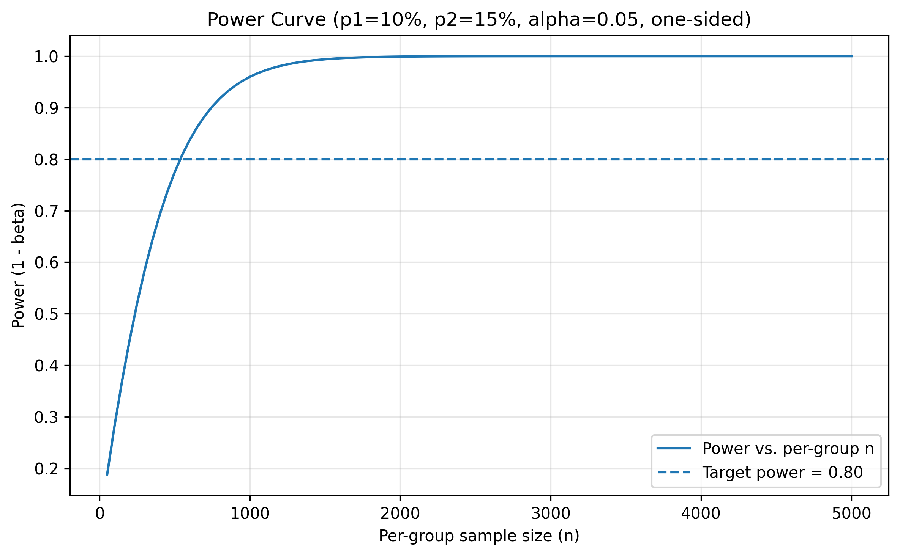
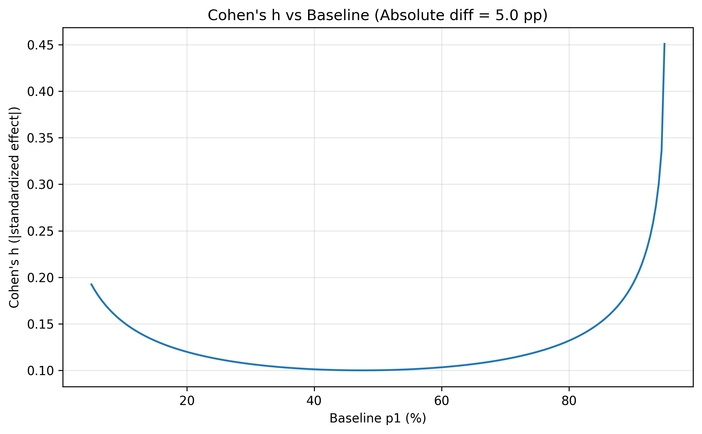

# ✈️ A/B Testing Flight Booking Conversion Rates

> 🌟 A practical data science project simulating an A/B test to evaluate the effect of a new pricing strategy on flight booking conversions — set in the context of an imaginary travel platform, **MyTravel.com**.

---

## 📌 Project Overview

The Flight Booking Team at MyTravel.com is planning to roll out a new pricing strategy and wants to test its impact before a full launch. To assess whether this strategy is actually increasing flight bookings — or if the observed change is simply due to chance — they've tasked **Miss Reem**, a **Data Scientist**, with designing and conducting a hypothesis test.

Miss Reem's job isn't just to crunch numbers; it's to ensure the experiment is statistically and practically significant, the data is analyzed rigorously, and the results are interpreted in a way that guides strategic decisions.

This project takes you through a realistic workflow:

- Simulate user-level booking data
- Design and implement an A/B test
- Apply hypothesis testing
- Visualize and interpret results

All with the goal of helping data professionals build intuition and confidence in experimentation.

---

## 👥 Target Audience

This project is designed for:

- Aspiring or working **Data Scientists**, **Analysts**, and **Product Managers**
- Candidates preparing for **A/B testing or product analytics interviews**
- Learners looking to **understand and apply hypothesis testing in a practical setting**

---

## 🧪 Why Hypothesis Testing?

The key question in business often is:

> "Is the observed improvement real or just random noise?"

In business, we frequently want to validate if a new strategy truly creates an improvement. But natural variation makes this tricky — especially for proportions (e.g., booking conversion rates).

That’s where **hypothesis testing** comes in.

---

### 🔍 What is Hypothesis Testing?

Miss Reem knows that it's impossible and impractical to run the experiment on the entire population. Instead, she can run an experiment on selected samples from the population. She's also well aware of the statistical method "hypothesis testing," which is used to make decisions or inferences about population parameters based on sample data. The process involves:

1. **Formulating two hypotheses:**

   - **Null Hypothesis (H₀):** Assumes no effect or no difference (e.g., "There is no difference in conversion rates between the control and treatment pages").
   - **Alternative Hypothesis (H₁):** Assumes there is an effect or a difference (e.g., "The new pricing page increases conversions").

2. **Designing the experiment:** Estimating the sample size based on Minimum Detectable Effect (MDE), Power, and Significance.

3. **Collecting data** from experiments or observations.

4. **Analyzing the data** to determine whether the evidence is strong enough to reject the null hypothesis in favor of the alternative.

---

### 🧪 What is A/B Experimentation?

Miss Reem decides to implement an A/B test — a practical form of hypothesis testing. It compares two versions (A and B) of a feature by randomly splitting users and measuring which performs better on a defined metric (like conversion rate).

---

## 📊 Two-Proportion Hypothesis Testing (A/B Experiment)

Two-proportion hypothesis testing is used to determine if there is a statistically significant difference between the proportions of a certain characteristic (e.g., conversion rate) in two independent groups.

**When to Use It:**

- You have two independent samples (e.g., control vs. treatment).
- Each sample yields a proportion (e.g., % of users who book flights).
- You want to know if the difference in these proportions is due to chance.

| Group | Description     |
| ----- | --------------- |
| A     | Control Group   |
| B     | Treatment Group |

**Null Hypothesis (H₀):** pA ≤ pB\
**Alternative Hypothesis (H₁):** pA > pB (one-tailed)

---

## 🌟 One-Tailed vs. Two-Tailed Tests

The choice of a one-tailed or two-tailed alternative hypothesis is critical.

- **One-Tailed Test (H₁: pₒ > pₑ):** This is used when you are only interested in detecting an effect in a specific direction. For example, if the new pricing strategy is only considered successful if it *increases* conversions, a one-tailed test is appropriate. It offers more statistical power to detect an effect in the specified direction. This means the rejection region for the null hypothesis is entirely in one tail of the sampling distribution.

- **Two-Tailed Test (H₁: pₒ ≠ pₑ):** This is more common in exploratory A/B testing as it can detect a significant difference in *either* direction (increase or decrease). If you're unsure whether the new strategy might increase or decrease conversions, or if a decrease would also be an important finding, a two-tailed test is more suitable. The rejection region is split between both tails of the sampling distribution.

In this project, a one-tailed test is chosen, implying that the team is primarily interested in detecting a positive uplift in conversion rates.

---

## 📜 Assumptions for Two-Proportion Z-Test

To ensure valid results, the following assumptions must hold:

- **Independence of observations** The outcomes for one user should not influence the outcomes for another user (via random assignment)
- **Independent samples** (no overlap between control and treatment)
- **Large enough sample sizes**: For the sampling distribution of the proportions to be approximately normal (Law of Large Numbers) - allowing the use of Z-scores - a common rule of thumb is at least 10 in each category

📐 **Choosing the Right Test: Z-Test vs T-Test**

| Test Type   | When to Use |
| ----------- | ----------- |
| **Z-Test**  | For large samples (`n > 30`) and known/approximated variance |
| **T-Test**  | For small samples (`n < 30`) or unknown population variance |
| **Chi-Square** | For categorical outcomes in contingency tables |

- In a two-proportion Z-test, the variance of a sample proportion is `p(1 - p) / n`, but since `p` is unknown, we estimate it using `p̂` (sample proportion).

- The standard error of the difference in proportions is:  
  `SE_(p̂1 - p̂2) = sqrt( (p̂1 * (1 - p̂1)) / n1  +  (p̂2 * (1 - p̂2)) / n2 )`  
  This SE is reliable when the variance estimates from each group are *reasonably stable*.

- Large sample sizes make these variance and SE estimates stable, allowing the normal approximation (Central Limit Theorem) to hold — making the Z-test valid.

- With small samples, SE estimates are unstable, so Fisher’s Exact Test or a Chi-square test is preferred over a Z-test.

---

## 🧪 Designing the Experiment

Miss Reem carefully considers the following:

### ✅ A/B Test Design Checklist

- **Define Business Impact (Minimum Detectable Effect - MDE):**

  - What uplift (e.g., +5% conversion) is meaningful to detect? 
  The MDE is not just a statistical parameter; it's a **business decision**. It represents the smallest change that would be considered financially or strategically worthwhile to implement. For instance, a 0.5% conversion uplift might be statistically significant but not justify the development and maintenance costs.
  - **Calculating MDE:** 
  If your baseline conversion rate (p1​) is known, and you define the MDE as a percentage *uplift* of that baseline, you can calculate p2​.
    - If the MDE is given as an *absolute* difference (e.g., an absolute increase of 5 percentage points), then p2​=p1​+5% --> if p1 is 10 then p2 = 15% = 0.15
    - If the MDE is given as a *relative* uplift of let's say 5% and p1 is 10% then p2 = 0.105 =10.5% \

- **Estimate Baseline (**************************************************************************************************************************************************************************************************************************************************************************************************************************p\_1**************************************************************************************************************************************************************************************************************************************************************************************************************************):**

  - Use historical data (last campaign, last month, etc.) to get an accurate estimate of the current conversion rate.

- **Choose α** 

  Confidence Interval — A **confidence interval** is a range of values that we're confident contains the **true effect** of what we're testing. The confidence level (e.g., 95%) indicates how likely it is that the interval contains the true population parameter. The significance level α is the complement of the confidence level (α = 1 − CI). For example, a 95% confidence level corresponds to α = 0.05. This α value represents the probability of making a **Type I error** — falsely rejecting the null hypothesis when it is actually true. that we’re confident contains the **true effect** of what we’re testing. **α** is (1- CI)

- **Choose Power** 

  Rejecting Null Hypothesis when it's False is power (here it's like rejecting that the conversion rate increased for the Treatment when it actually holds true for the entire population)

The goal is either to **Reject the Null Hypothesis** if it's not true (related to the **Power** of a Test) or **Do Not Reject** it if it is, in fact, true, based on the test results. If the test is poorly designed, the results can be biased and lead to the following errors.

## ⚖️ Type I and Type II Errors

| Error Type | Description                                        | Controlled by        | Example                        |
| ---------- | -------------------------------------------------- | -------------------- | ------------------------------ |
| Type I     | False positive — reject H₀ when it’s true          | Significance level α | You say B > A, but it’s not    |
| Type II    | False negative — fail to reject H₀ when it’s false | Power = 1 − β        | You say B = A, but B is better |

###

- **Calculate Minimum Sample Size:**

  Either through pooled statistics or through Cohen's d, Cohen's h

  **Sample size using raw proportions**
  **Formula (per group):**
  `n = ((Z_(1-α/2) * sqrt(2 * p * (1 - p)) + Z_(1-β) * sqrt(p1 * (1 - p1) + p2 * (1 - p2)))²) / (p1 - p2)²`

  Where:
  - `p = (p1 + p2) / 2` (pooled proportion)

  **Sample size using Cohen’s h (standardized effect size)**
  `h = 2 * (arcsin(sqrt(p1)) - arcsin(sqrt(p2)))`

### why we choose one formula over the other
When historical data exists → use raw proportions
When only effect size is known (e.g., small, medium, large), use Cohen’s h

- Why Cohen's Tranformation? \
  A **5% absolute difference** in proportions can have **very different magnitudes of impact** depending on **where it lies on the probability scale**. That's **exactly why Cohen's h** was created — to **standardize** the effect size on a **non-linear probability scale**.

## Why a 5% Difference Isn't Always Equal

Let’s look at two examples:

|     Comparison       |  p1  |  p2  | Absolute Difference |Cohen’s h (Standardized)|
| ---------------------| ---- | ---- | --------------------| -----------------------|
|   Small Baseline     | 0.10 | 0.15 |     0.05 (5%)       |          ≈ 0.148       |
|   Large Baseline     | 0.85 | 0.90 |     0.05 (5%)       |          ≈ 0.105       |

➡️ Although the **absolute difference** is 5% in both cases, the **Cohen’s h** is **smaller** for the high baseline. Why?

### 🔬 Because of the shape of the probability distribution:

- A difference from 10% to 15% means a **50% relative increase** in conversion.
- A difference from 85% to 90% is only **5.9% relative increase**.
- Also, **variance is not uniform** across the 0–1 probability scale.

> This **non-linearity** is captured by the **arcsin square root transformation** in Cohen's h.

---

## 📊 Understanding Effect Size: Cohen's d and Cohen's h

- **Cohen's d (for continuous data):**

  **When to use:** Cohen's d is used when comparing the means of two groups on a **continuous variable** (e.g., average revenue per user, time spent on page). It expresses the difference between two means in terms of standard deviation units.

  `d = (x̄₁ - x̄₂) / sₚ`

- **Cohen's h (for proportions):**

  **When to use:** Cohen's h is specifically designed for comparing **two proportions**, which is highly relevant for A/B testing conversion rates. It's a measure of effect size that accounts for the non-linear nature of proportions by using an arcsine transformation.

  `h = 2 * (arcsin(sqrt(p₁)) - arcsin(sqrt(p₂)))`

**Interpretation (both):**

- 0.2: Small effect
- 0.5: Medium effect
- 0.8: Large effect\

  ## 📊 4. Relationship Between CI, Type I Error, and Power
  |             Concept                    |            What it tells              |          Controlled by          |
  | -------------------------------------- | ------------------------------------- | ------------------------------- |
  | **Confidence Interval**                | The range of the possible true effect | Sample size, variability, alpha |
  | **Type I Error (α)**                   | Risk of a **false positive**          | Significance level (alpha)      |
  | **Power (1 - β)**                      | Ability to detect a **true positive** | Sample size, effect size, alpha |

---

### 🛡️ How to Avoid Errors

- Lower α to reduce Type I error (e.g., 0.01)
- Increase power to reduce Type II error (e.g., 0.90)
- Pre-register experiment design

